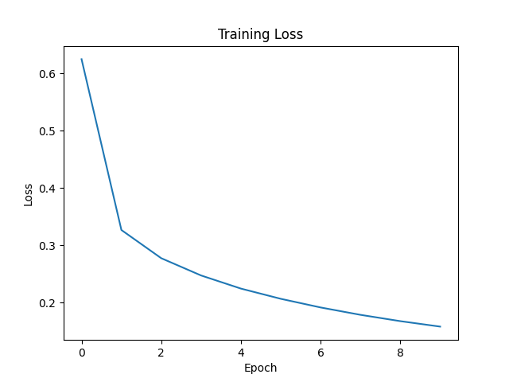
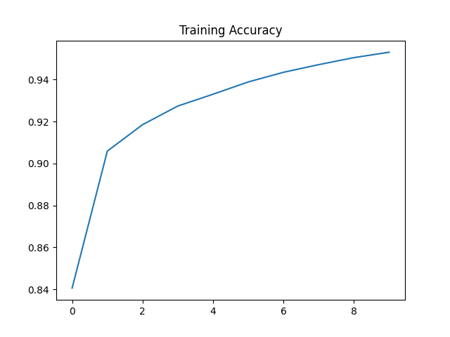

# Mini Deep Learning Framework from Scratch (NumPy)

Built a PyTorch-like deep learning framework from scratch with:
- Tensor class
- Autograd engine
- Neural networks
- Stable cross entropy
- SGD optimizer

Trained on MNIST → **94.9% accuracy**

## 📊 Results

| Metric | Value |
|------|------|
| Train Accuracy | 95% |
| Test Accuracy | 94.9% |

Trained using custom autograd engine (no PyTorch)

## ⚙️ Autograd Engine

Each Tensor stores:
- data
- gradient
- parent nodes
- backward function

During backward():
- traverse graph
- apply chain rule
- accumulate gradients

## 📈 Training Curves

### Loss Curve

### Accuracy Curve

## ⚠️ Numerical Stability

During training, naive softmax + log caused NaN issues due to:
- log(0)
- floating point underflow

Fixed using:
- Log-Sum-Exp trick
- Stable Cross Entropy implementation

This mirrors how frameworks like PyTorch implement `CrossEntropyLoss`.